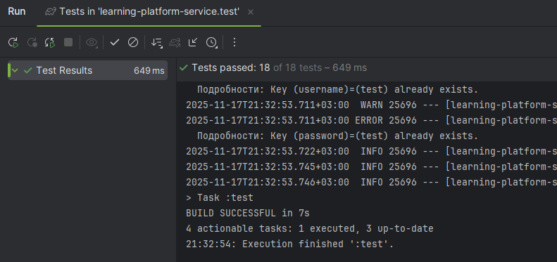

# Учебная платформа

## Описание 
Указанный проект имитирует некоторый функционал учебной платформы, позволяющий управлять учебными курсами/тестами, 
раздавать задания студентам, собирать их решения и проводить тестирование знаний.

---


## Требования
- JDK 17+;
- Gradle;
- Docker;
- IntelliJ IDEA для локального запуска;
- Postman для тестирования запросов.

---


## Архитектурные слои
- **Controllers** — REST API endpoints
- **DTO** — DTO-объекты с валидацией
- **Entities** — Модели данных (JPA сущности)
- **Exceptions** — Кастомные исключения
- **Mapper** — Мапперы для преобразования сущностей в DTO-объеты и обратно
- **Repositories** — Доступ к данным (Spring Data JPA репозитории)
- **Services** — Бизнес-логика приложения (Сервисы с транзакциями)
- **Resources** — Конфигурационные файлы приложения

---


## Результат тестов:


---


## Инструкция по запуску приложения
1. Клонируем репозиторий:
```bash
git clone https://github.com/euchekavelo/learning-platform-service
```

2. В корне проекта выполняем команды для очистки и сборки проекта:
```bash
./gradlew clean bootJar
```
3. Разворачиваем связку контейнеров нашего собранного приложения + БД PostgreSQL:
```bash
docker-compose up -d
```

---


## Проведение тестирования
Для проведения тестирования можно импортировать в Postman подготовленную коллекцию из файла "orm_postman_collection", 
расположенного в корне проекта.

---


## API Endpoints

- `POST /api/users` — Создать пользователя
- `POST /api/categories` — Создать категорию
- `POST /api/courses` — Создать курс
- `POST /api/modules` — Добавить модули
- `POST /api/lessons` — Добавить уроки в модуль
- `POST /api/enrollments` — Записать студента на курс
- `POST /api/assignments` — Создать задание
- `POST /api/submissions` — Отправить решение студентом
- `PATCH /api/submissions/{submissionId}` — Оценить решение преподавателем
- `GET /api/assignments/{assignmentId}/submissions?teacherId={userId}` — Получить список решений по заданию для преподавателя
- `GET /api/users/{userId}/submissions` — Получить список отправленных работ для студента
- `POST /api/quizes` — Создать тест
- `POST /api/questions` — Добавить вопрос к тесту
- `POST /api/answer-options` — Добавить вариант ответа к вопросу теста
- `POST /api/quiz-submissions` — Пройти тест студентом
- `GET /api/users/{userId}/quiz-submissions` — Получить результаты тестов студента
- `PUT /api/courses/{courseId}` — Обновить информацию о курсе
- `DELETE /api/courses/{courseId}` — Удалить курс
- `GET /api/users/{userId}/courses` — Получить информацию о курсах пользователя
- `DELETE /api/enrollments/{enrollId}` — Удалить решение
- `GET /api/courses/{courseId}` — Получить информацию о курсе

---


## Структура проекта
```markdown
learning-platform-service/
├── src/
│   ├── main/
│   │   ├── java/ru/mephi/learningplatformservice/
│   │   │   ├── controller/                 # REST контроллеры
│   │   │   ├── dto/                        # DTO для обмена информацией
│   │   │   ├── entity/                     # Сущности БД
│   │   │   │   ├── User.java               # Пользователи
│   │   │   │   ├── Course.java             # Курсы
│   │   │   │   ├── Category.java           # Категории
│   │   │   │   ├── Module.java             # Модули курсов
│   │   │   │   ├── Lesson.java             # Уроки
│   │   │   │   ├── Assignment.java         # Задания
│   │   │   │   ├── Submission.java         # Отправки решений
│   │   │   │   ├── Profile.java            # Профили
│   │   │   │   ├── Quiz.java               # Тесты
│   │   │   │   ├── Question.java           # Вопросы
│   │   │   │   ├── AnswerOption.java       # Варианты ответов
│   │   │   │   ├── QuizSubmission.java     # Отправки тестов
│   │   │   │   ├── Enrollment.java         # Записи студентов на курсы
│   │   │   │   ├── CourseReview.java       # Отзывы о курсах
│   │   │   │   └── Tag.java                # Теги
│   │   │   ├── repository/                 # Репозитории Spring Data JPA
│   │   │   ├── service/                    # Сервисы
│   │   │   ├── handler/                    # Обработчики исключений
│   │   │   ├── exception/                  # Кастомные исключения
│   │   │   ├── mapper/                     # Мапперы для сущностей и DTO
│   │   │   └── projection/                 # Проекции для частичного извлечения данных
│   │   └── resources/
│   │       ├── application.yml             # Основная конфигурация
│   │       ├── application-dev.yml         # Конфиг для разработки
│   │       ├── application-test.yml        # Конфиг для тестирования
│   │       └── init/                       # Папка со скриптами
│   │           └── data.sql                # SQL-файл для заполнения демо-данными
│   └── test/
│       └── java/ru/mephi/learningplatformservice/     # Тесты и конфигурация Testcontainers
├── docker-compose.yml                      # Docker Compose для запуска
├── Dockerfile                              # Конфигурация Docker образа
├── build.gradle.kts                        # Gradle конфигурация
├── orm_postman_collection                  # Коллекция Postman для тестирования
└── README.md                               # Документация проекта
```